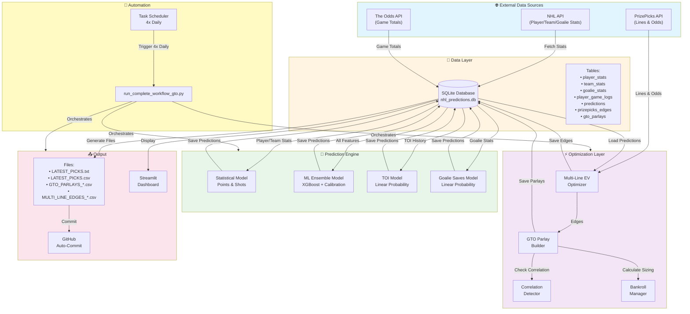
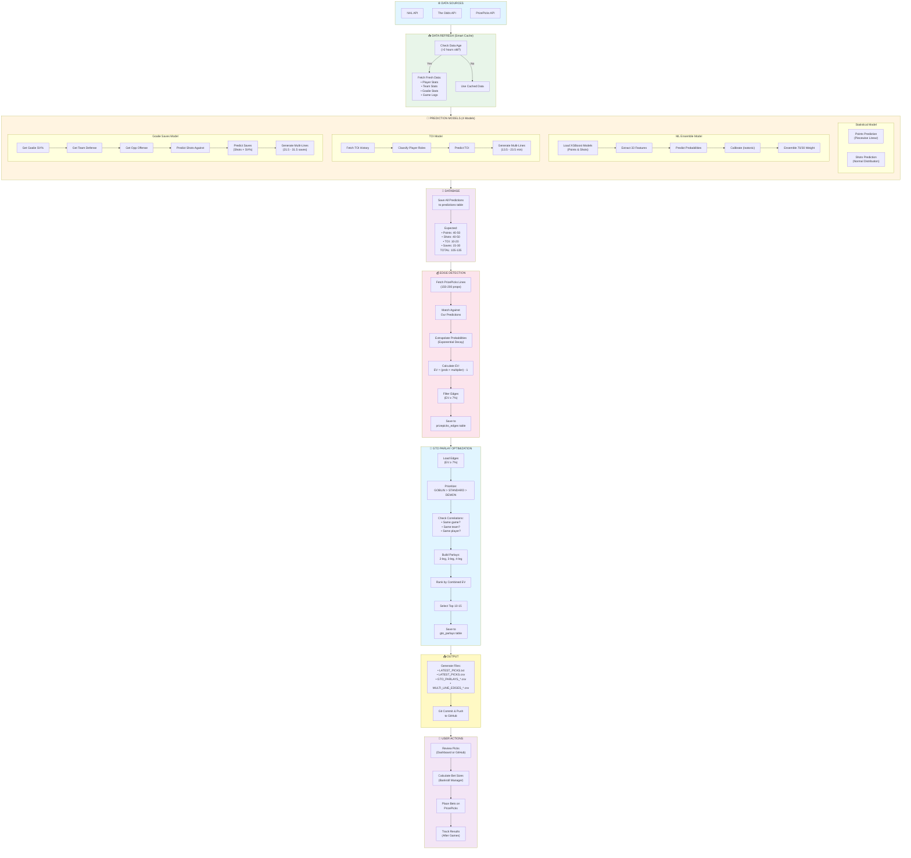
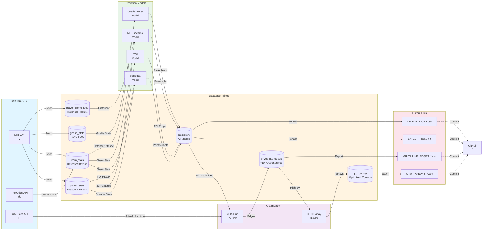
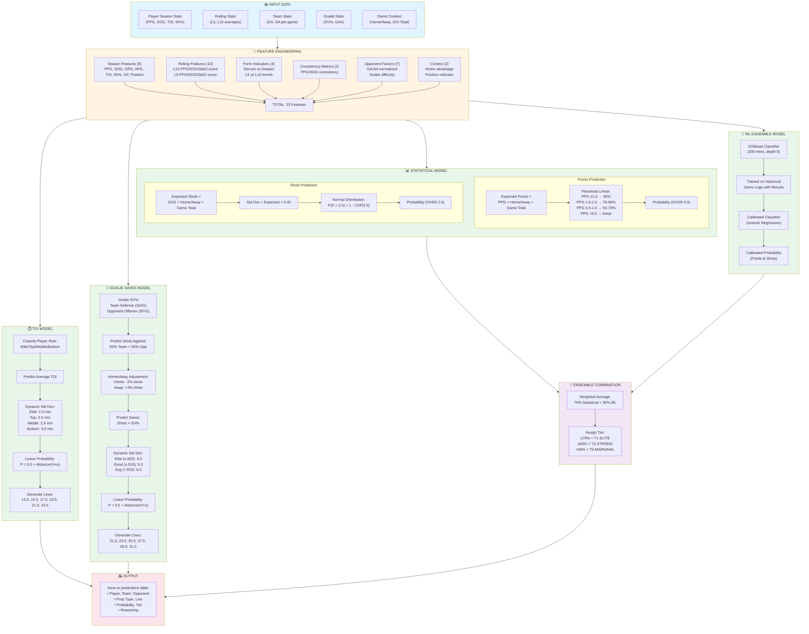
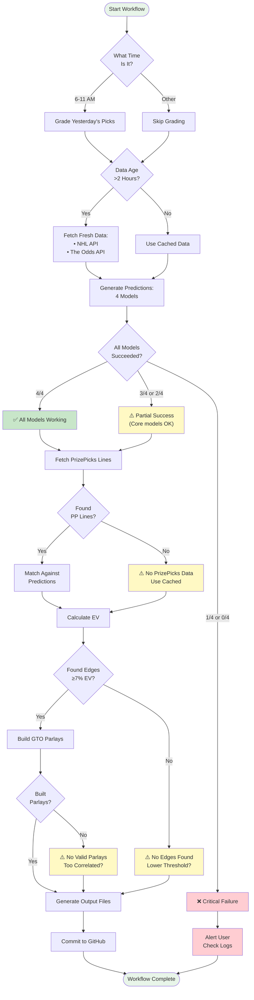

# NHL Betting System - Architecture Diagrams

**Date:** October 30, 2025
**Version:** 3.0 (with TOI & Goalie Saves integration)

---

## 📊 Diagram Index

1. [High-Level System Architecture](#1-high-level-system-architecture)
2. [Detailed Workflow Swim Lanes](#2-detailed-workflow-swim-lanes)
3. [Daily Automation Timeline](#3-daily-automation-timeline)
4. [Data Flow Diagram](#4-data-flow-diagram)
5. [Prediction Model Architecture](#5-prediction-model-architecture)
6. [Edge Detection & Optimization](#6-edge-detection--optimization)

---

## 1. High-Level System Architecture

---

## 2. Detailed Workflow Swim Lanes

---

## 3. Daily Automation Timeline

```mermaid
gantt
    title NHL Betting System - Daily Automation Schedule
    dateFormat HH:mm
    axisFormat %H:%M

    section Morning
    Wake Up & Coffee                    :milestone, m1, 07:00, 0m
    Review Yesterday Results            :a1, 07:30, 30m
    🤖 WORKFLOW #1 (8 AM)              :crit, w1, 08:00, 5m
    Grade Yesterday (if 6-11 AM)        :a2, 08:00, 3m
    Fetch Fresh Data (if >2hr old)      :a3, 08:03, 2m
    Generate 4 Prediction Models        :a4, 08:05, 3m
    Find Edges                          :a5, 08:08, 2m
    Build GTO Parlays                   :a6, 08:10, 1m
    Commit to GitHub                    :a7, 08:11, 1m
    Review Generated Picks              :a8, 08:15, 15m
    Calculate Bet Sizes                 :a9, 08:30, 15m
    Place Morning Bets                  :a10, 09:00, 60m

    section Midday
    Monitor Line Movement               :a11, 10:00, 120m
    🤖 WORKFLOW #2 (12 PM)             :crit, w2, 12:00, 5m
    Refresh Edges                       :a12, 12:00, 3m
    Rebuild Parlays                     :a13, 12:03, 2m
    Midday Strategy Session             :a14, 12:30, 90m

    section Afternoon
    🤖 WORKFLOW #3 (3 PM)              :crit, w3, 15:00, 5m
    Final Pre-Game Data Refresh         :a15, 15:00, 2m
    Update Predictions                  :a16, 15:02, 3m
    Final Betting Window                :a17, 17:00, 60m

    section Evening
    🤖 WORKFLOW #4 (6 PM) - FINAL      :crit, w4, 18:00, 5m
    Last Update Before Games            :a18, 18:00, 3m
    Finalize Parlays                    :a19, 18:03, 2m
    Pre-Game Review                     :a20, 18:30, 30m
    Games Start                         :milestone, m2, 19:00, 0m
    Live Monitoring (Optional)          :a21, 19:00, 180m
    Most Games End                      :milestone, m3, 21:00, 0m
    Record Results                      :a22, 21:00, 60m
    Day Wrap-Up                         :a23, 23:00, 30m
```

---

## 4. Data Flow Diagram

---

## 5. Prediction Model Architecture

---

## 6. Edge Detection & Optimization

```mermaid
flowchart TB
    subgraph Predictions["📊 OUR PREDICTIONS"]
        direction TB
        P1["Points: 40-50 picks<br/>Shots: 40-50 picks<br/>TOI: 10-20 picks<br/>Saves: 15-30 picks"]
        P2["For each pick:<br/>• Player, Prop Type<br/>• Line (e.g., O0.5 points)<br/>• Our Probability (e.g., 75%)"]

        P1 --> P2
    end

    subgraph PrizePicks["🎯 PRIZEPICKS LINES"]
        direction TB
        PP1["Fetch All Lines<br/>(150-200 props)"]
        PP2["For each line:<br/>• Player, Prop Type<br/>• Line (may differ from ours)<br/>• Odds Type (GOBLIN/STANDARD/DEMON)"]

        PP1 --> PP2
    end

    subgraph Matching["🔗 LINE MATCHING"]
        direction TB
        M1["Match by Player + Prop Type"]
        M2["Find PP line in our predictions"]

        M1 --> M2
    end

    subgraph Extrapolation["📈 PROBABILITY EXTRAPOLATION"]
        direction TB

        EX1{"Line Exact Match?"}
        EX2["Use Exact Probability"]
        EX3{"Line Between Two<br/>Predictions?"}
        EX4["Linear Interpolation"]
        EX5["Exponential Extrapolation"]

        EX1 -->|Yes| EX2
        EX1 -->|No| EX3
        EX3 -->|Yes| EX4
        EX3 -->|No| EX5

        subgraph Decay["Decay Rates by Prop"]
            D1["Points: 0.60 (aggressive)<br/>Goals: 0.55 (very aggressive)<br/>Assists: 0.65<br/>Shots: 0.72<br/>TOI: varies by tier<br/>Saves: varies by tier"]
        end

        EX5 --> Decay
    end

    subgraph EVCalc["💰 EV CALCULATION"]
        direction TB

        EV1["Get Individual Multiplier:<br/>GOBLIN: ~1.44x<br/>STANDARD: ~1.73x<br/>DEMON: ~2.0x"]
        EV2["PrizePicks Implied Prob:<br/>1 / multiplier"]
        EV3["Our Edge:<br/>(Our Prob - PP Prob) × 100"]
        EV4["Expected Value:<br/>(Our Prob × Multiplier) - 1"]
        EV5{"EV ≥ 7%?"}
        EV6["KEEP - This is an edge!"]
        EV7["DISCARD - No edge"]

        EV1 --> EV2 --> EV3 --> EV4 --> EV5
        EV5 -->|Yes| EV6
        EV5 -->|No| EV7
    end

    subgraph Edges["📋 EDGE PLAYS"]
        direction TB

        ED1["Typical Results:<br/>25-50 edge plays found"]
        ED2["Save to prizepicks_edges table"]
        ED3["Export to MULTI_LINE_EDGES_*.csv"]

        ED1 --> ED2 --> ED3
    end

    subgraph GTOInput["🎲 GTO PARLAY INPUTS"]
        direction TB

        G1["Filter: EV ≥ 7%"]
        G2["Prioritize:<br/>1. GOBLIN (most reliable)<br/>2. STANDARD<br/>3. DEMON (last resort)"]
        G3["Typical: 25-50 candidates"]

        G1 --> G2 --> G3
    end

    subgraph Correlation["🔗 CORRELATION CHECKS"]
        direction TB

        C1{"Same Game?"}
        C2{"Same Team?"}
        C3{"Same Player<br/>Different Props?"}
        C4{"Known Correlation<br/>(e.g., SOG + Points)?"}
        C5["AVOID - Correlated"]
        C6["OK - Independent"]

        C1 -->|Yes| C5
        C1 -->|No| C2
        C2 -->|Yes| C5
        C2 -->|No| C3
        C3 -->|Yes| C4
        C3 -->|No| C6
        C4 -->|Yes| C5
        C4 -->|No| C6
    end

    subgraph ParlayBuild["🏗️ PARLAY CONSTRUCTION"]
        direction TB

        PB1["Generate Combinations:<br/>2-leg, 3-leg, 4-leg"]
        PB2["For each parlay:<br/>Combined Prob = Prob1 × Prob2 × ..."]
        PB3["Parlay Multiplier:<br/>Mult1 × Mult2 × ..."]
        PB4["Parlay EV:<br/>(Combined Prob × Parlay Mult) - 1"]
        PB5["Rank by EV"]
        PB6["Select Top 10-15"]

        PB1 --> PB2 --> PB3 --> PB4 --> PB5 --> PB6
    end

    subgraph ParlayOutput["📤 PARLAY OUTPUT"]
        direction TB

        PO1["Save to gto_parlays table"]
        PO2["Export to GTO_PARLAYS_*.csv"]
        PO3["Display in Dashboard"]

        PO1 --> PO2 --> PO3
    end

    %% Main flow
    Predictions --> Matching
    PrizePicks --> Matching
    Matching --> Extrapolation
    Extrapolation --> EVCalc
    EVCalc --> Edges
    Edges --> GTOInput
    GTOInput --> Correlation
    Correlation --> ParlayBuild
    ParlayBuild --> ParlayOutput

    style Predictions fill:#e8f5e9
    style PrizePicks fill:#e1f5ff
    style Matching fill:#fff4e1
    style Extrapolation fill:#f3e5f5
    style EVCalc fill:#fce4ec
    style Edges fill:#e1f5ff
    style GTOInput fill:#fff9c4
    style Correlation fill:#f3e5f5
    style ParlayBuild fill:#e8f5e9
    style ParlayOutput fill:#fce4ec
```

---

## 7. Key Decision Points

---

## 📝 Diagram Legend

### Colors
- 🟦 **Blue** - External data sources, inputs
- 🟨 **Yellow** - Data storage, cache, database
- 🟩 **Green** - Prediction models, processing
- 🟪 **Purple** - Optimization, analysis
- 🟥 **Pink** - Output, results, exports
- 🟡 **Light Yellow** - Automation, scheduling

### Symbols
- `( )` - Start/End points
- `{ }` - Decision points
- `[ ]` - Process steps
- `[( )]` - Database storage
- `-->` - Data flow
- `-.->` - Optional/async flow

---

## 🎯 How to Read These Diagrams

### System Architecture (Diagram 1)
Shows the **big picture** - all major components and how they connect. Start here to understand overall structure.

### Workflow Swim Lanes (Diagram 2)
Shows **sequential flow** through different system layers. Read top-to-bottom to follow the process.

### Daily Timeline (Diagram 3)
Shows **when things happen** throughout the day. The yellow bars are automated workflows.

### Data Flow (Diagram 4)
Shows **where data comes from** and **where it goes**. Follow the arrows to trace data movement.

### Model Architecture (Diagram 5)
Shows **how predictions are made** in detail. Each model has its own logic flow.

### Edge Detection (Diagram 6)
Shows **how we find betting opportunities** and build parlays. Critical for understanding profit generation.

---

## 🚀 Quick Navigation

**Want to understand...**
- Overall system? → See Diagram 1
- Step-by-step process? → See Diagram 2
- Daily schedule? → See Diagram 3
- Data sources? → See Diagram 4
- How predictions work? → See Diagram 5
- How we make money? → See Diagram 6

---

**END OF ARCHITECTURE DIAGRAMS**

These diagrams are rendered automatically in Markdown viewers that support Mermaid (GitHub, VS Code, etc.)
